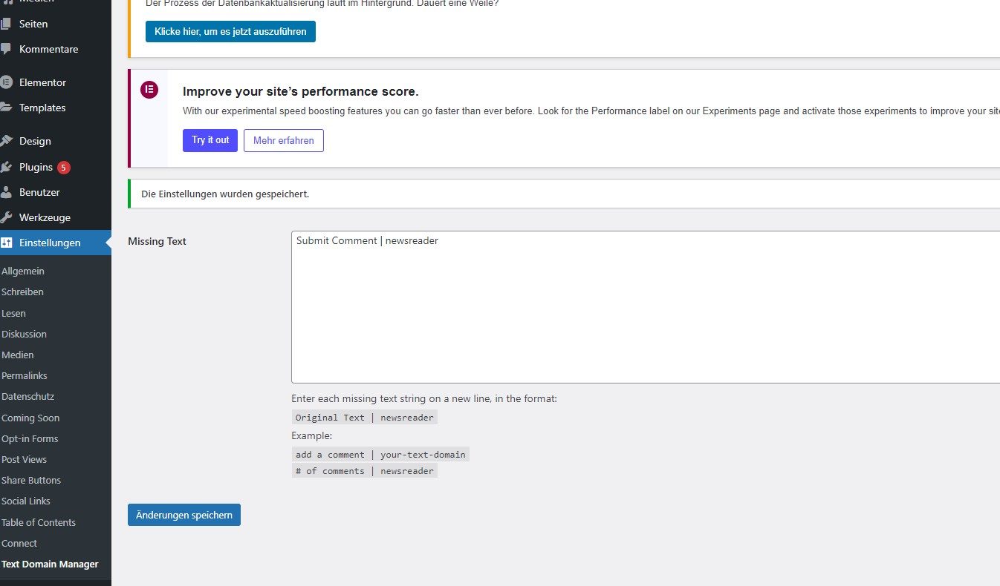

# Featured Posts Block

Displays selected posts in a widget.

To find a post ID in WordPress:

In the Admin Dashboard:
Go to Posts > All Posts, hover over the post title, and look at the browser’s bottom status bar. The number shown as post=123 in the URL is the post ID.

While Editing a Post:
When editing a post, check the URL in your browser's address bar. It will look like:
example.com/wp-admin/post.php?post=123&action=edit
The 123 in the URL is the post ID.

---

Thank you for exploring these plugins! If you have any feedback or suggestions, feel free to share them in the respective GitHub repositories. 😊  

